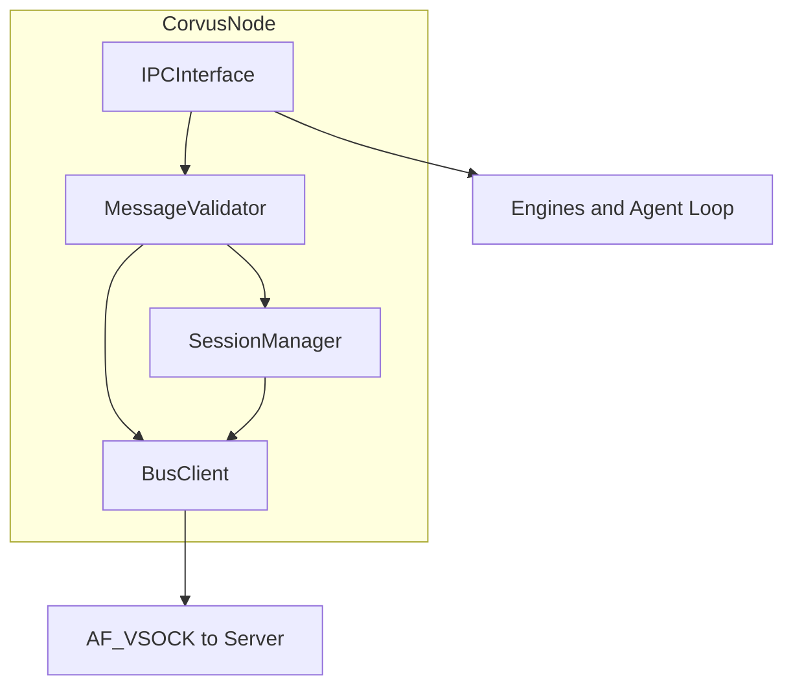

**Document:** CORVUS-NODE.md
**Status:** Implemented — Current
**Organization:** Black Rain Labs
**Division:** Research & Development Division
**Last Updated:** 2026-08-20
**Related Documents:** agent-vm/ARCHITECTURE.md, agent-vm/AGENT-WORKFLOW.md, hypervisor/FRAMEWORK-MESSAGE-PROTOCOL.md, OVERVIEW.md, CHANGES.md
**Must Update on Change:** CHANGES.md
**AI Instruction:** When revising this document, review Core Principles & Invariants in OVERVIEW.md, update CHANGES.md, and ensure consistency with related documents. Do not contradict core fundamentals.

# Corvus Node Architecture

## 1. Role

The Corvus Node is the **sole external interface** of each agent microVM. It serves as the narrow, hardened boundary between untrusted agent internals and the trusted Corvus Server. The Node performs local structural validation and message routing; deep policy decisions remain on the Corvus Server.

## 2. Key Responsibilities

### 2.1 AF_VSOCK Gateway
- Maintains AF_VSOCK connection to Corvus Server
- Connection establishment, teardown, exponential backoff on transient failure
- NDJSON framing per FRAMEWORK-MESSAGE-PROTOCOL Section 14

### 2.2 Local Structural Validation (Outbound)
- Required header fields present and correctly typed
- `source.engine` matches registered IPC endpoint (anti-spoofing)
- Message `type` allowed for originating engine per policy snapshot
- Capability tags consistent with engine (Engine 4 only for `memory:*`)
- Rate limiting per engine
- Handshake complete before non-system traffic

### 2.3 Boot-time Handshake
See FRAMEWORK-MESSAGE-PROTOCOL Section 11. Sequence:
1. Open AF_VSOCK
2. Send `handshake` request with manifest hash and registered engines
3. Receive session token and policy snapshot
4. Send `handshake` response acknowledgment
5. Mark session active; notify Agent Loop (INIT → RECEIVE)

### 2.4 Session & State Management
- Session token and expiry
- Policy snapshot cache (rate limits, allowed message types)
- Outstanding request correlation IDs (for inbound response routing)
- Does **not** maintain full turn state (Agent Loop + Corvus Server)

### 2.5 Inbound Message Handling
- Receive from Corvus Server over AF_VSOCK
- Validate protocol version and session context
- Route to engine or Agent Loop per Section 6 routing table

## 3. IPC Interface Contract

The IPC boundary between Agent Loop, engines, and Corvus Node.

### 3.1 Transport

| Property | Value |
|----------|-------|
| Transport | Unix domain socket (stream) |
| Path | `/run/corvus/node.sock` (configurable via env `CORVUS_NODE_SOCK`) |
| Framing | NDJSON — one FrameworkMessage per line |
| Encoding | UTF-8 JSON |

Each engine and the Agent Loop connect as a separate client. The Node maintains a registry mapping socket peer credentials to `EngineId`.

### 3.2 Operations

Clients send **IPC envelopes** wrapping FrameworkMessages:

```yaml
ipc_envelope:
  operation: submit_outbound | receive_inbound | subscribe_engine | health_check
  engine: loop | engine1 | engine2 | engine3 | engine4
  message: FrameworkMessage | null    # required for submit_outbound
```

| Operation | Direction | Description |
|-----------|-----------|-------------|
| `submit_outbound` | Client → Node | Engine/loop submits message for validation and AF_VSOCK forward |
| `receive_inbound` | Node → Client | Node pushes server-originated message to registered client |
| `subscribe_engine` | Client → Node | Register engine identity at boot; returns policy snapshot subset |
| `health_check` | Client → Node | Returns `{ status: ok, handshake_complete: bool, session_expires_at }` |

**`submit_outbound` flow:**
1. Client sends envelope with FrameworkMessage
2. Node sets `source.engine` from registered IPC client (overwrites client-supplied value)
3. Node runs validation pipeline
4. On success: forward to AF_VSOCK; return `{ accepted: true, message_id }`
5. On failure: return `{ accepted: false, error: FrameworkMessage }` with `class: error`

**`receive_inbound`:** Node initiates push to the client registered for `destination.target`. Clients must read asynchronously (asyncio reader task).

### 3.3 Origin Attestation

At VM boot, each engine process calls `subscribe_engine`:

```yaml
ipc_envelope:
  operation: subscribe_engine
  engine: engine3
  payload:
    process_id: integer              # optional audit
    manifest_engine_hash: string     # must match launch manifest entry
```

Node registers `(socket_fd → engine)` mapping. All subsequent messages on that socket have `source.engine` forced to the registered engine. Mismatch between message content and registration → `NODE_ORIGIN_SPOOF`.

The Agent Loop registers as `engine: loop`. Corvus Node itself originates system messages with `source.engine: corvus_node` internally (not via IPC).

### 3.4 Allowed Message Types by Engine

From policy snapshot (defaults in FRAMEWORK-MESSAGE-PROTOCOL Section 11):

| Engine | Outbound Types |
|--------|----------------|
| `loop` | Internal coordination only; no direct AF_VSOCK forward |
| `engine1` | `tool_call`, `tool_result` |
| `engine2` | `user_query`, `agent_response` |
| `engine3` | `llm_request`, `llm_response` |
| `engine4` | `memory:query`, `memory:write`, `memory:grant_request` |
| `corvus_node` | `handshake`, `error`, `elevation` (system) |

## 4. Inbound Routing Table

| `destination.type` | `destination.target` | `type` (if target ambiguous) | Route To |
|--------------------|----------------------|--------------------------------|----------|
| `engine` | `engine1` | any | Engine 1 IPC client |
| `engine` | `engine2` | any | Engine 2 IPC client |
| `engine` | `engine3` | any | Engine 3 IPC client |
| `engine` | `engine4` | any | Engine 4 IPC client |
| `loop` | `loop` | any | Agent Loop IPC client |
| `corvus_server` | * | * | Invalid inbound — reject `NODE_ROUTING_FAILED` |
| `broadcast` | * | `agent_response` | Engine 2 |
| `broadcast` | * | `tool_call` | Engine 1 |
| `broadcast` | * | `llm_response` | Engine 3 |
| `broadcast` | * | `memory:*` | Engine 4 |
| `broadcast` | * | other | Agent Loop |

Routing uses `destination.target` first; if `broadcast`, fall back to `type` prefix matching.

## 5. Rate Limiting Policy

Per-engine token bucket from policy snapshot. Defaults:

| Engine | messages/sec | burst |
|--------|--------------|-------|
| engine1 | 10 | 20 |
| engine2 | 10 | 20 |
| engine3 | 5 | 10 |
| engine4 | 10 | 20 |
| loop | 20 | 40 |

On exceed: reject with `NODE_RATE_LIMITED`, `recoverable: true`. Client should backoff 100ms × 2^attempt (max 5s).

Policy snapshot updates on re-handshake only (VM restart or session renewal).

## 6. Error Code Catalog (Node Layer)

Maps to FRAMEWORK-MESSAGE-PROTOCOL Section 13:

| Code | When | Recoverable |
|------|------|-------------|
| `NODE_VALIDATION_FAILED` | Missing/invalid envelope fields | yes |
| `NODE_ORIGIN_SPOOF` | Engine mismatch on IPC socket | no |
| `NODE_CAPABILITY_DENIED` | Disallowed message type for engine | yes |
| `NODE_RATE_LIMITED` | Token bucket exhausted | yes |
| `NODE_HANDSHAKE_INCOMPLETE` | Non-handshake traffic before session active | yes |
| `NODE_ROUTING_FAILED` | Inbound target not registered | yes |

All errors returned as FrameworkMessage `class: error`, `type: error`, with payload per protocol Section 10.2.

## 7. Module Boundaries



| Module | Inputs | Outputs | Responsibility |
|--------|--------|---------|----------------|
| `CorvusNode` | Config, lifecycle events | Running daemon | Orchestrates submodules; asyncio event loop |
| `IPCInterface` | Unix socket connections | IPC envelopes | Accept connections; engine registration; read/write NDJSON |
| `MessageValidator` | FrameworkMessage, engine registry | pass/fail + error code | Structural and capability validation |
| `SessionManager` | Handshake messages | session token, policy snapshot | Handshake state machine; token expiry checks |
| `BusClient` | Validated messages | AF_VSOCK I/O | Server connection; backoff; NDJSON framing |

**LOC target:** ~1000–1500 lines Python including tests stubs, excluding generated code.

## 8. Error Handling & Recovery

- Validation failure → structured `error` to originator; VM continues
- AF_VSOCK transient failure → exponential backoff (1s, 2s, 4s, 8s, max 60s); buffer outbound queue max 100 messages
- Handshake failure after 5 retries → log critical; Agent Loop stays in INIT
- Repeated validation failures (>10/min same engine) → report `system` event to server

## 9. Implementation Considerations (Python)

Recommended packages: `asyncio`, stdlib `socket`/`json`; optional `pydantic` for validation.

```python
class CorvusNode:
    async def run(self) -> None: ...
    async def handle_ipc(self, reader, writer) -> None: ...
    async def forward_to_server(self, msg: FrameworkMessage) -> None: ...
    async def deliver_inbound(self, msg: FrameworkMessage) -> None: ...
```

Use separate asyncio tasks for IPC listener, AF_VSOCK reader, and AF_VSOCK writer.

## 10. Serialization

**Phase 2:** JSON (NDJSON) on both IPC and AF_VSOCK. See FRAMEWORK-MESSAGE-PROTOCOL Section 14.

## 11. Performance Targets (Phase 3)

Deferred from Phase 2 implementation; targets for validation:
- IPC round-trip validation: P99 < 2ms
- Throughput: >500 messages/sec aggregate per VM
- Memory footprint: <32 MB RSS

**Black Rain Labs - Research & Development Division**
