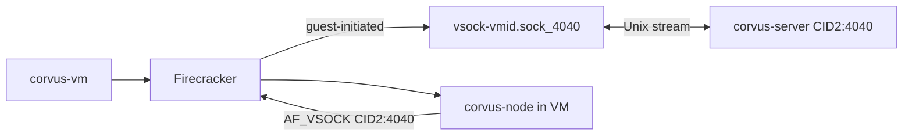

**Document:** FIRECRACKER.md
**Status:** Implemented — Local Smoke Verified
**Organization:** Black Rain Labs
**Division:** Research & Development Division
**Last Updated:** 2026-08-20
**Related Documents:** agent-vm/ARCHITECTURE.md, agent-vm/CORVUS-NODE.md, CHANGES.md
**Must Update on Change:** CHANGES.md

# Firecracker Integration

## Overview

Each Corvus agent runs in an isolated Firecracker microVM with a read-only rootfs. The host runs `corvus-server` (AF_VSOCK listener on host CID 2, port 4040, plus per-VM Unix sockets at `{CORVUS_VM_STATE_DIR}/vsock-{vm_id}.sock_{port}` for guest-initiated traffic) and `corvus-vm` to launch/stop VMs.

## Architecture



## Host Requirements

- Linux with `/dev/kvm` and `/dev/vsock`
- Launch user must be able to read/write `/dev/kvm` (usually membership in the `kvm` group)
- `firecracker` binary on `PATH`
- Docker (for rootfs build)
- Python 3.12+ with `corvus-hypervisor` installed

If using `setfacl` for immediate `/dev/kvm` access, treat it as temporary; device reloads can drop the ACL. Permanent `kvm` group membership applies after a new login session.

## Environment Variables

| Variable | Default | Description |
|----------|---------|-------------|
| `CORVUS_VSOCK_HOST_CID` | `2` | Host vsock CID (listen + guest connect target) |
| `CORVUS_VSOCK_PORT` | `4040` | VSOCK port |
| `CORVUS_VSOCK_GUEST_CID_START` | `3` | First guest CID allocated at launch |
| `CORVUS_ARTIFACTS_DIR` | `./artifacts` | Kernel and rootfs images |
| `CORVUS_KERNEL_PATH` | `artifacts/vmlinux` | Guest kernel |
| `CORVUS_ROOTFS_PATH` | `artifacts/rootfs.ext4` | Read-only rootfs |
| `CORVUS_FIRECRACKER_BIN` | `firecracker` | VMM binary |
| `CORVUS_VM_STATE_DIR` | `/tmp/corvus-vms` | Short state path for Firecracker API and vsock sockets |

## Build Rootfs

```bash
bash tools/rootfs/fetch-kernel.sh
bash tools/rootfs/build.sh   # requires Docker + sudo
```

The rootfs builder uses `python:3.12-slim-bookworm` so the guest Python runtime satisfies the project requirement (`>=3.12`) while preserving the systemd service layout.

`CORVUS_MANIFEST_PATH` may point at a selected launch manifest during rootfs build. The builder copies that manifest to `/etc/corvus/manifest.json`, computes its canonical hash, and writes the hash into `/etc/corvus/env`.

## Launch VM

```bash
export CORVUS_USE_TCP=0
corvus-server &
corvus-vm launch --agent test-agent-01
corvus-vm status
corvus-vm stop --vm <vm_instance_id>
```

Or via Management API:

```bash
curl -X POST -H "X-API-Key: dev-api-key" http://127.0.0.1:8080/v1/agents/test-agent-01/launch
curl -X POST -H "X-API-Key: dev-api-key" http://127.0.0.1:8080/v1/agents/test-agent-01/stop
```

## Smoke Test

```bash
bash tools/vm-smoke.sh
```

The smoke test requires local KVM/vsock access. It verifies Firecracker launch, Management API `running` status, **guest Engine 4 memory write/query over VSOCK** (polls server SQLite for a `turn-*` record), and stop cleanup.

Rebuild the rootfs after Engine 4 client changes (`bash tools/rootfs/build.sh`) before expecting the memory check to pass. Skip memory validation with `CORVUS_VM_SMOKE_SKIP_MEMORY=1`. Adjust wait timeout with `CORVUS_VM_MEMORY_TIMEOUT` (default 120 seconds).

The normal CI suite validates the TCP runtime path; Firecracker smoke runs on a self-hosted runner with KVM (see `.github/workflows/firecracker-smoke.yml`).

## Guest Process Layout

| systemd unit | Process |
|--------------|---------|
| `corvus-node.service` | AF_VSOCK gateway + IPC socket |
| `corvus-loop.service` | Agent Loop state machine in daemon mode |
| `corvus-engine1.service` … `engine4` | Engine processes in daemon mode (engine4 performs memory write/query during COLLECT) |

Configuration: `/etc/corvus/env`, manifest: `/etc/corvus/manifest.json`

At VM launch, Corvus also writes a per-VM package under `CORVUS_VM_STATE_DIR/launch-packages/<vm_instance_id>/` with the canonical manifest and generated env file. The launcher injects `CORVUS_AGENT_ID`, `CORVUS_VM_ID`, `CORVUS_MANIFEST_HASH`, VSOCK settings, and registered engines through Firecracker boot arguments so the guest identity matches the server-side agent definition even when the base rootfs is shared.

The VM registry retains lifecycle records after stop/failure and surfaces PID liveness, launch logs, last error, stop reason, and whether the stop path was graceful. These fields feed Management API health and future GUI status views.

**Black Rain Labs - Research & Development Division**
