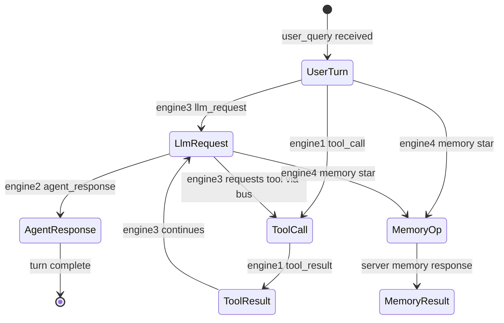

**Document:** hypervisor/FRAMEWORK-MESSAGE-PROTOCOL.md
**Status:** Implemented — Current
**Organization:** Black Rain Labs
**Division:** Research & Development Division
**Last Updated:** 2026-07-11
**Related Documents:** OVERVIEW.md, hypervisor/ARCHITECTURE.md, agent-vm/ARCHITECTURE.md, agent-vm/CORVUS-NODE.md, agent-vm/AGENT-WORKFLOW.md, memory/ARCHITECTURE.md, CHANGES.md
**Must Update on Change:** CHANGES.md
**AI Instruction:** When revising this document, review Core Principles & Invariants in OVERVIEW.md, update CHANGES.md, and ensure consistency with related documents. Do not contradict core fundamentals.

# FrameworkMessage Protocol

## 1. Overview

The FrameworkMessage Protocol is the fundamental communication contract in Corvus. Every interaction — user input, tool execution, memory operations, LLM calls, and cross-agent coordination — is expressed as a `FrameworkMessage` that travels over the bus.

All communication is message-based. There are no direct function calls or shared memory between components.

## 2. Design Principles

- Explicit intent and capability tagging
- Correlation over semantic understanding
- Server is the authoritative validation point
- Narrow, well-defined endpoints (Corvus Server and Corvus Node)
- Deterministic validation (no LLM inspection in the hypervisor)
- Clear engine separation (see 4-Engine Model below)

## 3. 4-Engine Model Reference

The protocol explicitly supports the four engines inside each agent microVM:

- **Engine 1 (Tools & Skills)**: Local tool execution only.
- **Engine 2 (Gateway/Channels)**: External formatting and platform handling.
- **Engine 3 (LLM / Inference)**: LLM calls and reasoning. Highly restricted in what messages it can originate.
- **Engine 4 (Memory)**: Only engine permitted to emit `memory:*` message types. All memory operations are mediated by the Corvus Server.

The `source.engine` field in every message must accurately reflect which engine originated the message. Corvus Node validates origin against registered engine IPC endpoints (see CORVUS-NODE.md).

## 4. Message Envelope

```yaml
framework_message:
  version: "2.0"

  id: uuid
  correlation_id: uuid
  sequence: integer
  timestamp: iso8601

  source:
    agent_id: string
    engine: "loop" | "engine1" | "engine2" | "engine3" | "engine4" | "corvus_node"
    vm_id: string

  destination:
    type: "engine" | "loop" | "corvus_server" | "broadcast"
    target: string

  class: "request" | "response" | "event" | "error" | "system"
  type: string                    # e.g. tool_call, memory:query, llm_request, user_query

  tags:
    triggered_by: "user_input" | "agent_initiated" | "tool_result" | "memory_result" | "system"
    origin_correlation_id: uuid | null
    requested_capability: string | null
    scope: "local" | "cross_agent" | "external"

  security:
    may_leave_vm: boolean
    requires_elevation: boolean
    risk_score: integer           # Advisory (1-5)

  payload: object
```

### Field Naming Convention

- **`source.engine`** is the authoritative origin field. Implementations must not use a separate `sender_id`; validation layers refer to `source.engine` exclusively.
- **`correlation_id`** identifies a logical turn or request chain. Responses reuse the request's `correlation_id`.
- **`tags.origin_correlation_id`** links derived actions (tool calls, memory ops) back to the root user-initiated turn.

## 5. Reference Python Model

```python
from dataclasses import dataclass, field
from datetime import datetime
from enum import Enum
from typing import Any, Literal, Optional
from uuid import UUID


class EngineId(str, Enum):
    LOOP = "loop"
    ENGINE1 = "engine1"
    ENGINE2 = "engine2"
    ENGINE3 = "engine3"
    ENGINE4 = "engine4"
    CORVUS_NODE = "corvus_node"


class MessageClass(str, Enum):
    REQUEST = "request"
    RESPONSE = "response"
    EVENT = "event"
    ERROR = "error"
    SYSTEM = "system"


class DestinationType(str, Enum):
    ENGINE = "engine"
    LOOP = "loop"
    CORVUS_SERVER = "corvus_server"
    BROADCAST = "broadcast"


class TriggeredBy(str, Enum):
    USER_INPUT = "user_input"
    AGENT_INITIATED = "agent_initiated"
    TOOL_RESULT = "tool_result"
    MEMORY_RESULT = "memory_result"
    SYSTEM = "system"


class Scope(str, Enum):
    LOCAL = "local"
    CROSS_AGENT = "cross_agent"
    EXTERNAL = "external"


@dataclass
class MessageSource:
    agent_id: str
    engine: EngineId
    vm_id: str


@dataclass
class MessageDestination:
    type: DestinationType
    target: str


@dataclass
class MessageTags:
    triggered_by: TriggeredBy
    origin_correlation_id: Optional[UUID] = None
    requested_capability: Optional[str] = None
    scope: Scope = Scope.LOCAL


@dataclass
class MessageSecurity:
    may_leave_vm: bool = False
    requires_elevation: bool = False
    risk_score: int = 1


@dataclass
class FrameworkMessage:
    version: Literal["2.0"] = "2.0"
    id: UUID = field(default_factory=UUID)
    correlation_id: UUID = field(default_factory=UUID)
    sequence: int = 0
    timestamp: datetime = field(default_factory=datetime.utcnow)
    source: MessageSource = field(default_factory=MessageSource)
    destination: MessageDestination = field(default_factory=MessageDestination)
    class_: MessageClass = field(metadata={"alias": "class"})
    type: str = ""
    tags: MessageTags = field(default_factory=MessageTags)
    security: MessageSecurity = field(default_factory=MessageSecurity)
    payload: dict[str, Any] = field(default_factory=dict)
```

Production implementations may use Pydantic v2 for validation; the field names above are normative.

## 6. Key Validation Rules

- `source.engine` must match the registered IPC endpoint that submitted the message.
- Only Engine 4 may emit messages with `type` prefixed `memory:` or `requested_capability` prefixed `memory.`.
- Engine 3 may not set `may_leave_vm: true` on outbound requests except `llm_request` routed to Corvus Server.
- Messages with `may_leave_vm: true` receive additional server-side scrutiny.
- Correlation chains must be valid for request/response pairs and for tool/memory/LLM actions (see Section 10).
- Unknown or mismatched tags result in rejection.

## 7. Bus Architecture

- **Internal Bus** (inside microVM): Lightweight messaging between Agent Loop, engines, and Corvus Node via Unix domain socket IPC.
- **Central Bus** (Corvus Server): Authoritative routing layer. All inter-agent and external traffic must pass through the Corvus Server over AF_VSOCK.

## 8. Endpoints

### Corvus Server (Authoritative Endpoint)
- Final validation authority
- Applies RBAC, grants, correlation, and capability checks
- Maintains session/turn state for contextual validation
- Performs behavioral monitoring
- Full audit logging of every hop

### Corvus Node (Agent-side Endpoint)
- Sole external interface of the microVM
- Local structural validation before messages leave or after they arrive
- Boot-time handshake participant
- Narrow IPC interface to Agent Loop and engines
- Does **not** hold long-term signing keys

## 9. Message Categories

| Category           | Example Types                          | Primary Engine | Notes |
|--------------------|----------------------------------------|----------------|-------|
| User Interaction   | `user_query`, `agent_response`         | Engine 2       | Entry/exit points |
| Tool Execution     | `tool_call`, `tool_result`             | Engine 1 / 3   | Must trace to user intent via correlation |
| LLM / Inference    | `llm_request`, `llm_response`          | Engine 3       | Restricted capability tags |
| Memory             | `memory:query`, `memory:write`, `memory:grant_request` | Engine 4 | Requires valid grant for cross-agent access |
| System             | `handshake`, `error`, `elevation`      | Corvus Node    | Special handling |

## 10. Payload Schemas

All payloads are JSON objects. Required fields are marked **(R)**.

### 10.1 System: `handshake`

**Request** (Node → Server, `class: system`):

```yaml
payload:
  manifest_hash: string          # (R) SHA-256 of launch manifest
  protocol_version: "2.0"        # (R)
  vm_instance_id: string         # (R) Firecracker instance ID
  agent_id: string               # (R)
  registered_engines:            # (R) engines present in this VM
    - engine1
    - engine2
    - engine3
    - engine4
```

**Response** (Server → Node, `class: system`):

```yaml
payload:
  session_token: string          # (R) opaque bearer token for this VM session
  session_expires_at: iso8601    # (R)
  policy_snapshot:               # (R) see Section 11
    version: string
    rate_limits: object
    allowed_message_types: object
  server_time: iso8601
```

### 10.2 System: `error`

```yaml
payload:
  code: string                   # (R) from Error Catalog (Section 13)
  layer: "node" | "server" | "policy"  # (R)
  message: string                # (R) human-readable summary
  recoverable: boolean           # (R)
  details: object                # optional structured context
  original_message_id: uuid      # message that caused the error, if any
```

### 10.3 System: `elevation`

```yaml
payload:
  elevation_id: uuid             # (R)
  action_summary: string         # (R)
  requested_by: string           # agent_id or user_id
  context:
    correlation_id: uuid
    message_type: string
    risk_score: integer
  status: "pending" | "approved" | "denied" | "expired"
  approver: string | null
  expires_at: iso8601
```

### 10.4 User: `user_query`

```yaml
payload:
  user_id: string                # (R) resolved user profile ID
  platform: string               # e.g. whatsapp, telegram, api
  channel_id: string             # platform-specific session/channel
  content:
    text: string                 # (R)
    attachments: []              # optional media references
  locale: string                 # optional, default en-US
```

### 10.5 User: `agent_response`

```yaml
payload:
  user_id: string                # (R)
  platform: string               # (R)
  channel_id: string             # (R)
  content:
    text: string                 # (R)
    attachments: []
  turn_correlation_id: uuid      # (R) root turn ID
```

### 10.6 Tool: `tool_call`

```yaml
payload:
  tool_name: string              # (R) must be in launch manifest
  arguments: object              # (R) tool-specific params
  timeout_seconds: integer       # optional, default 30
```

### 10.7 Tool: `tool_result`

```yaml
payload:
  tool_name: string              # (R)
  success: boolean               # (R)
  result: object | null
  error: string | null
  duration_ms: integer
```

### 10.8 LLM: `llm_request`

```yaml
payload:
  provider: string               # (R) e.g. deepseek, openai
  model: string                  # (R)
  messages:                      # (R) chat completion format
    - role: string
      content: string
  max_tokens: integer
  temperature: float
  stream: boolean                 # optional; when true, server streams chunks (local tools_schema and hybrid provider tools supported)
  tools_schema: [] | null         # optional OpenAI-style function tool definitions (local mode)
  provider_tools_requested: [] | null  # gateway-internal; hybrid provider tool names
```

Manifest gate (launch): `engines.engine3.tool_execution_mode` is `local` (default) or `hybrid`; `provider_tools` must be empty in local mode.

When `stream: true`, the server returns a synchronous `llm_stream_start` on the request/response line, then pushes `llm_stream_chunk` events and a final `llm_response` via the active agent transport (same path as elevation replay). Streaming supports local-mode `tools_schema` (Phase 7.2b): text deltas stream as usual and the final `llm_response` may carry `tool_calls` (`finish_reason: tool_calls`) for Engine 3 to dispatch to Engine 1. As of Phase 7.2+, streaming also supports hybrid provider-hosted tools: the gateway forwards registry-approved hosted tools on the upstream stream request and records `provider_tools_used` / `trust_boundary` on the final `llm_response` with the same audit events as non-stream hybrid.

### 10.9 LLM: `llm_stream_start` (server-origin, sync ack)

Returned immediately when `llm_request.payload.stream` is true.

```yaml
payload:
  success: boolean               # (R)
  provider: string
  model: string
  error: string | null           # when success=false
  error_code: string | null
```

### 10.10 LLM: `llm_stream_chunk` (server-origin, event)

```yaml
payload:
  index: integer                 # (R) monotonic chunk index
  delta: string                  # (R) text fragment
```

### 10.11 LLM: `llm_response` (server-origin)

Engine 3 sends `llm_request`; the Corvus Server LLM gateway completes the upstream call and returns `llm_response` inbound to Engine 3. The agent VM must **not** emit outbound `llm_response` messages.

```yaml
payload:
  success: boolean               # (R)
  provider: string               # (R)
  model: string                  # (R)
  content: string | null         # present when success
  tool_calls: []                 # model-requested local tools (not executed on server)
  provider_tools_used: []        # present when hybrid mode forwarded provider-hosted tools
  trust_boundary: string | null  # "provider" when provider_tools_used is non-empty
  usage:
    prompt_tokens: integer
    completion_tokens: integer
  finish_reason: string
  error: string | null           # present when success=false
  error_code: string | null
```

`tool_calls` in local mode are proposals only — Engine 3 dispatches to Engine 1 for VM execution. Provider-hosted tools in hybrid mode may execute on inference infrastructure; actions are not fully auditable in Corvus.

`tags.triggered_by` on inbound responses: `llm_result`.

### 10.10 Memory: `memory:query`

```yaml
payload:
  namespace: string              # (R) e.g. private, shared-knowledge
  target_agent_id: string        # (R) agent whose memory is queried (self or cross-agent)
  query_type: "key" | "semantic" | "list"  # (R)
  query:
    key: string | null           # for key lookup
    text: string | null          # for semantic search
    limit: integer               # default 10
  grant_id: uuid | null          # required when target_agent_id != source.agent_id
```

### 10.11 Memory: `memory:write`

```yaml
payload:
  namespace: string              # (R)
  target_agent_id: string        # (R) usually source agent; cross-agent requires grant
  record:
    key: string | null
    content: string              # (R)
    metadata: object
    ttl_seconds: integer | null
  grant_id: uuid | null
```

### 10.12 Memory: `memory:grant_request`

```yaml
payload:
  target_agent_id: string        # (R) agent whose memory is requested
  namespace: string              # (R)
  permissions: ["read"] | ["read", "write"] | ["read", "write", "delete"]  # (R)
  reason: string                 # (R) for elevation workflow
  requested_duration_seconds: integer  # default 3600
```

## 11. Handshake Protocol

Sequence (matches CORVUS-NODE.md boot flow):

1. Corvus Node opens AF_VSOCK to Corvus Server.
2. Node sends `handshake` request with manifest attestation.
3. Server validates manifest hash against registered agent definition.
4. Server returns session token and policy snapshot.
5. Node stores session token; all subsequent outbound messages include it in payload extension field `session_token` (top-level envelope extension, not shown in base schema — carried in `payload._session` for Phase 2).
6. Node sends `handshake` response acknowledgment (`class: response`, same `correlation_id`).
7. Agent Loop transitions from INIT to RECEIVE.

**Policy snapshot schema:**

```yaml
policy_snapshot:
  version: string                # snapshot version for cache invalidation
  rate_limits:
    engine1: { messages_per_sec: 10, burst: 20 }
    engine2: { messages_per_sec: 10, burst: 20 }
    engine3: { messages_per_sec: 5, burst: 10 }
    engine4: { messages_per_sec: 10, burst: 20 }
    loop: { messages_per_sec: 20, burst: 40 }
  allowed_message_types:
    engine1: [tool_call, tool_result]
    engine2: [user_query, agent_response]
    engine3: [llm_request, llm_response]
    engine4: [memory:query, memory:write, memory:grant_request]
```

**Session token format:** Opaque UUID v4 string, valid for the VM lifetime or until `session_expires_at`. Server rejects messages with invalid or expired tokens with error code `SERVER_SESSION_INVALID`.

**Session binding and server-initiated delivery are scoped to `(agent_id, vm_id)`.** At handshake the server binds the connection under the composite key `(agent_id, vm_instance_id)`, so multiple VMs of the same agent connect independently without colliding. All server-initiated pushes — LLM stream chunks, `llm_response`, elevation replays, and `memory:grant_created` notifications — are routed to the specific `(agent_id, vm_id)` that originated the corresponding request, and offline replay (`pending_replay`) is queued and flushed per VM. Inbound messages are additionally validated so that `source.vm_id` matches the session's `vm_id` (mismatch → `SERVER_SESSION_INVALID`), in addition to the existing `agent_id` check.

## 12. Correlation Chain Rules

### 12.1 Definitions

- **Turn correlation ID**: The `correlation_id` assigned at `user_query` receipt. All actions in that turn share this ID or reference it via `tags.origin_correlation_id`.
- **Chain depth**: Maximum 8 hops from root `user_input` turn (configurable via policy snapshot).
- **Turn timeout**: Default 300 seconds from last `user_query` in a turn; orphaned actions after timeout are rejected with `SERVER_CORRELATION_EXPIRED`.

### 12.2 Valid Chain State Machine



### 12.3 Rules

1. **`user_query`**: Sets root `correlation_id`. `tags.triggered_by` must be `user_input`. `tags.origin_correlation_id` is null.
2. **Derived actions** (`tool_call`, `memory:*`, `llm_request` after first in turn): Must set `tags.origin_correlation_id` to the turn's root `correlation_id` and `tags.triggered_by` to `agent_initiated` or `tool_result` as appropriate.
3. **`tool_result`**: `tags.triggered_by` = `tool_result`; must reference the `tool_call` via shared `correlation_id` on the request/response pair.
4. **Cross-agent messages**: `tags.scope` = `cross_agent`; server validates grant before delivery.
5. **Orphan rejection**: Messages with `origin_correlation_id` pointing to unknown or expired turns are rejected at the server with `SERVER_CORRELATION_INVALID`.

### 12.4 Request/Response Pairing

- Responses must reuse the request's `correlation_id`.
- Response `source.engine` may differ from request (e.g., server responds to engine4 memory query).
- `sequence` increments monotonically per `(agent_id, correlation_id)` pair.

## 13. Error Catalog

| Code | Layer | Recoverable | Description |
|------|-------|-------------|-------------|
| `NODE_VALIDATION_FAILED` | node | yes | Structural validation failed (missing fields, wrong types) |
| `NODE_ORIGIN_SPOOF` | node | no | `source.engine` does not match IPC submitter |
| `NODE_CAPABILITY_DENIED` | node | yes | Engine attempted disallowed message type |
| `NODE_RATE_LIMITED` | node | yes | Per-engine rate limit exceeded |
| `NODE_HANDSHAKE_INCOMPLETE` | node | yes | Message sent before handshake completed |
| `NODE_ROUTING_FAILED` | node | yes | Inbound message could not be routed |
| `SERVER_SESSION_INVALID` | server | no | Missing or expired session token |
| `SERVER_CORRELATION_INVALID` | server | yes | Invalid or broken correlation chain |
| `SERVER_CORRELATION_EXPIRED` | server | yes | Turn timeout exceeded |
| `SERVER_RBAC_DENIED` | policy | yes | Policy engine returned deny |
| `SERVER_ELEVATION_REQUIRED` | policy | yes | Action requires human approval |
| `SERVER_GRANT_DENIED` | policy | yes | Memory grant missing or expired |
| `SERVER_QUOTA_EXCEEDED` | policy | yes | LLM token or rate quota exceeded |
| `SERVER_ROUTING_FAILED` | server | yes | Unknown destination agent or engine |
| `SERVER_INTERNAL_ERROR` | server | no | Unexpected server failure |

**Error message example:**

```yaml
class: error
type: error
source:
  engine: corvus_node
  agent_id: research-agent-01
  vm_id: fc-vm-abc123
destination:
  type: engine
  target: engine3
correlation_id: <original>
payload:
  code: NODE_CAPABILITY_DENIED
  layer: node
  message: Engine 3 cannot emit memory:query messages
  recoverable: true
  details:
    attempted_type: memory:query
    allowed_types: [llm_request, llm_response]
  original_message_id: <uuid>
```

## 14. Serialization

**Phase 2 default:** JSON over AF_VSOCK (VM ↔ Server) and JSON over Unix domain socket (internal IPC). Messages are newline-delimited JSON (NDJSON) frames: one `FrameworkMessage` per line.

**Future (Phase 5+):** Optional binary framing (length-prefixed MessagePack or CBOR) may be added with `version: "2.1"` negotiation during handshake. Phase 2 implementations must support JSON only.

## 15. Versioning

- Current version: `2.0`
- Breaking envelope changes require a new major version and handshake negotiation.
- Payload schemas may evolve additively within `2.x` (new optional fields only).

**Black Rain Labs - Research & Development Division**
