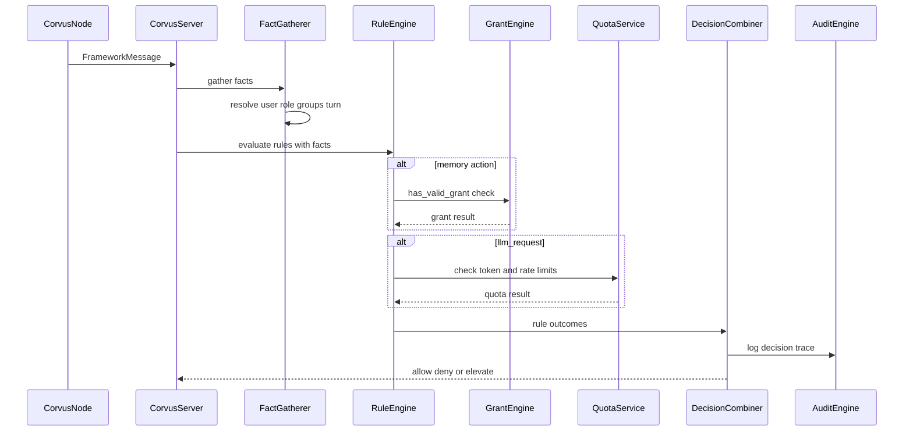

**Document:** hypervisor/RBAC-POLICY.md
**Status:** Implemented — RBAC Scope Aligned
**Last Updated:** 2026-07-05
**Organization:** Black Rain Labs
**Division:** Research & Development Division
**Related Documents:** OVERVIEW.md, hypervisor/MANAGEMENT-API.md, hypervisor/FRAMEWORK-MESSAGE-PROTOCOL.md, memory/ARCHITECTURE.md, CHANGES.md
**Must Update on Change:** CHANGES.md
**AI Instruction:** When revising this document, review Core Principles & Invariants in OVERVIEW.md, update CHANGES.md, and ensure consistency with related documents. Do not contradict core fundamentals.
**API Caution:** Any changes must consider impact on the Management API surface (see hypervisor/MANAGEMENT-API.md). Maintain backward compatibility where possible and document breaking changes.

# RBAC & Policy Engine Architecture

## 1. Overview

The RBAC/Policy Engine is a **highly modular, declarative, and auditable** Policy Decision Point (PDP). It supports multi-dimensional decisions, contextual validation, channel identity assurance, explicit memory grants, quota checks, elevation records, and modification via configuration/API without changing core code.

**Default posture:** Deny. A message is allowed only when a matching rule with `effect: allow` succeeds, or when a valid memory grant satisfies a grant-conditioned rule.

## 2. Core Design (Modular & Extensible)

The engine comprises four layers:

1. **Fact Gatherer (PIP)** — Collects context from FrameworkMessage, user profile, turn state, grant store, and quota counters.
2. **Rule Engine** — Evaluates declarative rules against facts.
3. **Decision Combiner** — Applies conflict resolution and produces final decision.
4. **Auditor** — Logs every decision with rule-matching trace.

Rules are stored as **versioned, declarative data** (YAML/JSON) managed via the Management API.

## 3. Evaluation Pipeline



### 3.1 Fact Gatherer Inputs

| Fact | Source |
|------|--------|
| `user_id`, `role`, `groups` | User profile resolved from `user_query` or session |
| `agent_id`, `engine`, `message_type` | FrameworkMessage `source` and `type` |
| `correlation_chain_valid` | Turn state store (FRAMEWORK-MESSAGE-PROTOCOL Section 12) |
| `triggered_by`, `scope` | FrameworkMessage `tags` |
| `has_valid_grant` | Grant Engine (memory/ARCHITECTURE.md Section 4.3) |
| `provider`, `model` | `llm_request` payload |
| `tool_execution_mode` | Agent manifest `engines.engine3.tool_execution_mode` (default `local`) |
| `provider_tools_requested` | `llm_request` payload when hybrid provider tools are forwarded |
| `behavioral_signals` | Behavioral monitor (Phase 5; placeholders in Section 9) |
| `quota_remaining` | Quota Service counters |
| `identity_channel`, `identity_alias`, `identity_verified`, `auth_method` | Identity Resolver from CLI/API/chat aliases |

## 4. Rule Format

```yaml
rules:
  - id: "researcher-tool-access"
    priority: 100
    subject:
      role: ["researcher", "admin"]
    object:
      agent_id: "*"
      engine: ["engine1", "engine4"]
    action:
      type: ["tool_call", "memory:query"]
    condition:
      correlation_chain_valid: true
    effect: "allow"

  - id: "memory-cross-agent"
    priority: 80
    subject:
      agent_id: "cve-scanner-01"
    object:
      target_agent: "analysis-agent-07"   # rule object field; message payload uses target_agent_id
    action:
      type: "memory:*"
    condition:
      has_valid_grant: true
    effect: "allow"
    else: "elevate"
```

**Modularity features:**
- Rules added/removed/prioritized without code changes
- Custom conditions registered as plugins (Phase 4+)
- Scoped to agents, users, or groups

Implemented rule validation rejects unsupported fields before rules are stored or activated. Rules can match identity channel and authentication method, so CLI/API PIN verification and chat aliases can be represented in the same PDP flow as role, group, agent, engine, and message-type constraints.

## 5. Rule Conflict Resolution

### 5.1 Evaluation Order

1. Gather all rules whose `subject`, `object`, and `action` patterns match the request.
2. Sort matching rules by **priority descending** (higher number = evaluated first).
3. Evaluate conditions top-to-bottom until a decisive outcome is reached.

### 5.2 Decision Semantics

| Scenario | Outcome |
|----------|---------|
| First matching rule with `effect: allow` and all conditions pass | **Allow** — stop evaluation |
| First matching rule with `effect: deny` and all conditions pass | **Deny** — stop evaluation |
| Matching rule with failed conditions and `else: elevate` | **Elevate** — stop evaluation |
| Matching rule with failed conditions and no `else` | Continue to next rule |
| No matching allow rule after full scan | **Deny** (default-deny) |

**Deny wins over allow at equal priority:** If two rules at the same priority conflict, `deny` takes precedence. Implementations should log a `RULE_CONFLICT` audit warning when this occurs.

### 5.3 Accumulation vs First-Match

Corvus uses **first-match-wins** after priority sort, not cumulative voting. A single decisive rule terminates evaluation.

### 5.4 Performance (Large Rule Sets)

- Rules indexed by `(action.type, object.agent_id, subject.role)` hash buckets at load time.
- Target: <5ms P99 evaluation for up to 1,000 rules (Phase 2).
- Rulesets versioned; hot-reload swaps index atomically.

## 6. Grant Integration

The `has_valid_grant` condition delegates to the Grant Engine defined in [memory/ARCHITECTURE.md](../memory/ARCHITECTURE.md).

**Evaluation steps:**
1. Extract `target_agent_id`, `namespace`, and optional `grant_id` from message payload.
2. If `target_agent_id == source.agent_id` and namespace is owned: grant check **skipped** (implicit owner access).
3. Otherwise call `GrantEngine.evaluate(subject_agent, target_agent, namespace, permission, grant_id)`.
4. Map result: valid → condition passes; invalid → condition fails (trigger `else: elevate` if present).

Grant records use the schema in memory/ARCHITECTURE.md Section 4. RBAC rules reference grants; they do not duplicate grant storage. Memory FrameworkMessage payloads use `target_agent_id`; `target_agent` is accepted only as a transitional payload/API boundary alias and as the persisted grant/rule object field.

Current implementation includes a DB-backed Grant Engine for RBAC evaluation. It validates subject agent, target agent, namespace, permission, expiry, optional grant ID, and implicit owner access. This is control-plane grant evaluation only; Memory Service storage, memory record access, and memory operation execution remain Phase 4 work.

## 7. Quota Enforcement Model

### 7.1 Counter Storage

Quota counters stored in SQLite (same Corvus Server DB):

```yaml
quota_counter:
  key: string                      # e.g. user:alpha-admin:llm_tokens:daily
  limit: integer
  used: integer
  window_start: iso8601
  window_type: daily | hourly | rpm
  reset_at: iso8601
```

### 7.2 Enforcement Rules

| Quota Type | Window | On Exceed |
|------------|--------|-----------|
| `daily_token_limit` | 24h rolling from first use | Deny with `SERVER_QUOTA_EXCEEDED` |
| `rate_limit_rpm` | 1 minute sliding | Deny with `SERVER_QUOTA_EXCEEDED` |
| `cost_quota_usd` | Daily | Elevate (admin review) for researcher role; deny for operator |

Rules may embed quota limits in `condition` (see Section 12 example). The Quota Service increments counters **after** allow decision for `llm_request` based on `usage` in the server-generated `llm_response` (`prompt_tokens + completion_tokens` on key `user:{id}:llm_tokens:daily`).

Provider usage is audited via `llm_completion` events (provider, model, token counts, latency — never prompt bodies or credential material).

### 7.3 Management API

See MANAGEMENT-API.md quota endpoints for viewing and resetting counters.

## 8. Group Inheritance

```yaml
groups:
  - id: "research-team"
    members: ["user-a", "user-b"]
    parent_group: "engineering"    # optional
    inherited_rules: true
    rule_ids: ["researcher-tool-access"]
```

**Rules:**
- **Max inheritance depth:** 3 levels (child → parent → grandparent). Deeper nesting rejected at API validation.
- **Rule merging:** Child group rules append to parent rules; all evaluated in unified priority sort.
- **Deny wins:** Explicit deny on child group overrides parent allow at same priority.
- **Member resolution:** User's effective groups = direct memberships + all ancestor groups up to depth 3.

## 9. Delegation Model

Runtime delegation grants temporary capability without permanent rule changes.

```yaml
delegation:
  delegation_id: uuid
  delegator: string                # admin user_id
  delegatee: string                # user_id or agent_id
  permissions:
    - action: tool_call
      tool_name: web_search
      agent_id: research-agent-01
  expires_at: iso8601              # (R) max 24h without re-approval
  created_at: iso8601
```

**Elevation trigger conditions** (auto-create elevation when no rule matches):
- `memory:grant_request` — always elevates unless admin pre-approved template exists
- `requires_elevation: true` on message security block
- Unknown `tool_name` not in manifest
- Behavioral signal threshold exceeded (see Section 10)

Delegations evaluated before static rules; active delegation matching the request produces **Allow** at priority 200 (above standard rules).

## 10. Behavioral Signal Hooks

Signals collected by `BehavioralMonitor` and exposed as `behavioral_signals` policy facts:

| Signal | Type | Window | Default threshold | Typical effect |
|--------|------|--------|-------------------|----------------|
| `message_rate_anomaly` | float (z-score) | 1 min vs 60 min baseline | > 3.0 | elevate |
| `tool_pattern_deviation` | boolean | 1 min vs baseline tool-call rate | true when z-score > 3.0 | elevate |
| `repeated_grant_denials` | integer | 10 min | > 3 | deny |
| `cross_agent_scope_spike` | integer | 1 min | > 10/min | deny |

**Grant denial counting:** increments only on cross-agent memory ops where grant evaluation returns `no_valid_grant` (not own-namespace access).

Rule conditions use comparators, e.g. `repeated_grant_denials: { gt: 3 }`.

Simulate API accepts `context.behavioral_signals` overrides for dry-run evaluation.

Config env vars: `CORVUS_BEHAVIORAL_GRANT_DENIAL_WINDOW_MINUTES`, `CORVUS_BEHAVIORAL_RATE_ZSCORE_THRESHOLD`, `CORVUS_BEHAVIORAL_TOOL_ZSCORE_THRESHOLD`, etc.

**Tool-call deviation:** `BehavioralMonitor.record_approved_tool_call` increments per-minute `tool_call` counters after an approved `tool_call`. `tool_pattern_deviation` is true when the current-minute tool-call rate z-score vs the baseline window exceeds `CORVUS_BEHAVIORAL_TOOL_ZSCORE_THRESHOLD` (default 3.0).

## 11. User Profiles & Aliases

```yaml
user_profiles:
  - id: "alpha-admin"
    role: "admin"
    groups: ["engineering"]
    aliases:
      - {platform: "whatsapp", value: "555-010-1001"}
      - {platform: "telegram", value: "@brl_alpha"}
    contact_list:
      - {name: "Beta-Contact", platform: "whatsapp", alias: "555-010-1002"}
    allowed_agents: ["*"]
```

Channel aliases are first-class RBAC inputs:

- CLI/API human actions require a verified PIN/password result before privileged `user_id` facts are trusted.
- Chat channels such as WhatsApp resolve users from stable identifiers such as phone number, platform user ID, username, or workspace/team ID.
- Alias records include `platform`, `value`, `verified`, `auth_method`, `last_verified_at`, and optional `display_name`.
- Unknown or unverified aliases are low-assurance identities and should default-deny sensitive actions or trigger elevation.

## 12. Granular LLM Controls

```yaml
rules:
  - id: "researcher-llm-access"
    priority: 90
    subject: { role: "researcher" }
    object: { agent_id: "*", engine: "engine3" }
    action: { type: "llm_request" }
    condition:
      provider: ["deepseek", "openai"]
      model: ["deepseek-v4-flash"]
      daily_token_limit: 100000
      rate_limit_rpm: 30
    effect: "allow"
```

### 12.1 Tool execution mode (Phase 7.4)

Default rules in `config/default_rules.yaml` gate LLM requests by manifest `tool_execution_mode`:

| Rule | Role | Mode | Effect |
|------|------|------|--------|
| `allow-llm-request` | researcher, admin | `local` | allow |
| `allow-llm-request-hybrid` | admin | `hybrid` | allow |
| `deny-hybrid-llm-without-admin` | researcher, operator, anonymous | `hybrid` | deny |

Hybrid mode allows provider-hosted tools only when manifest, provider registry, and admin RBAC all agree. Local function tools still require Engine 1 manifest allowlist and `tool_call` RBAC.

## 13. Elevation & Human-in-the-Loop

When decision is **Elevate**:
1. Create elevation record with full message context and correlation chain.
2. Notify authorized contacts from user profile or admin queue.
3. Return `SERVER_ELEVATION_REQUIRED` to agent with `elevation_id`.
4. On approval: record approval and optionally create a runtime grant or delegation.
5. On denial: return `SERVER_RBAC_DENIED` with elevation reference.

Elevation records expire after 1 hour if not actioned.

Current implementation persists elevation records and exposes approval/denial API surfaces. Approval and denial require an admin user, membership in an elevation-approver group, or explicit elevation approval privilege with valid CLI/API credentials. On approval, the server may create a runtime grant and **automatically replay** the stored memory operation (or `pending_replay` from a grant request) via `ElevationReplayService`. When the agent transport is connected, Engine 4 receives `memory:*_response` and `memory:grant_created`; disconnected agents get grant persistence only (`replay_delivered: false`).

Dangerous actions are classified before rule evaluation. Shell/tool calls with high or critical risk, explicit `requires_elevation`, or dangerous command patterns such as destructive filesystem changes, privilege escalation, service control, firewall changes, mounts, shutdown/reboot, or piped remote scripts trigger `dangerous_action: true`. The default rules elevate dangerous `tool_call` messages before ordinary tool-call allow rules can match.

## 14. Rule Simulation API Contract

`POST /v1/rules/simulate` — dry-run without side effects.

**Request:**

```yaml
simulate_request:
  message:
    source:
      agent_id: string
      engine: string
    type: string
    tags:
      triggered_by: string
      scope: string
    payload: object
  context:
    user_id: string
    correlation_chain_valid: boolean
    has_valid_grant: boolean | null    # override; null = evaluate live
    behavioral_signals: object         # optional overrides
```

**Response:**

```yaml
simulate_response:
  decision: allow | deny | elevate
  matched_rules:
    - id: string
      priority: integer
      effect: string
      conditions_passed: boolean
      reason: string
  grant_evaluation:
    checked: boolean
    valid: boolean | null
    grant_id: uuid | null
  quota_impact:
    would_consume_tokens: integer | null
    remaining_after: integer | null
    would_exceed: boolean
  explanation_trace:
    - step: string
      detail: string
  effective_error_code: string | null    # e.g. SERVER_RBAC_DENIED
```

## 15. Integration with Bus & Auditing

Every message evaluated at Corvus Server before routing or execution.

**Audit decision record:**

```yaml
policy_decision:
  timestamp: iso8601
  message_id: uuid
  correlation_id: uuid
  decision: allow | deny | elevate
  matched_rule_ids: [string]
  grant_id: uuid | null
  quota_key: string | null
  explanation_trace: [object]
```

RBAC auditability requirements:

- Rule create/update/delete, identity resolution, authentication checks, grant evaluation, quota evaluation, elevation lifecycle, and policy decisions use stable audit event fields.
- Correlation IDs, message IDs, agent IDs, VM IDs, user IDs, alias/channel/auth facts, matched rule IDs, grant IDs, quota keys, elevation IDs, decisions, and effective error codes are retained where available.
- Structured logs and audit details must redact secrets, PINs, passwords, session tokens, and raw credentials.
- `RULE_CONFLICT` traces are emitted when deny and allow match at the same priority.

## 16. Policy Testing Framework

Beyond simulation:
- **Fixture suite:** YAML files with `input message + expected decision` pairs run in CI.
- **Regression gate:** Rule changes require passing fixture suite before activation.
- **Version pinning:** Active ruleset tagged with version; simulation defaults to draft ruleset unless `?active=true`.

Phase 2 delivers simulation endpoint + fixture format. Phase 6 adds the CI runner:

- Fixture files live under `config/policy_fixtures/*.yaml`
- Run locally: `corvus-policy-fixtures` or `make fixtures`
- CI executes the fixture suite on every push/PR alongside pytest

## 17. Modularity & Future GUI Support

- Rules are data-driven for future visual rule builder.
- API-first design (MANAGEMENT-API.md) for external tooling.
- Core PDP engine stable; rules evolve independently.

**Black Rain Labs - Research & Development Division**
