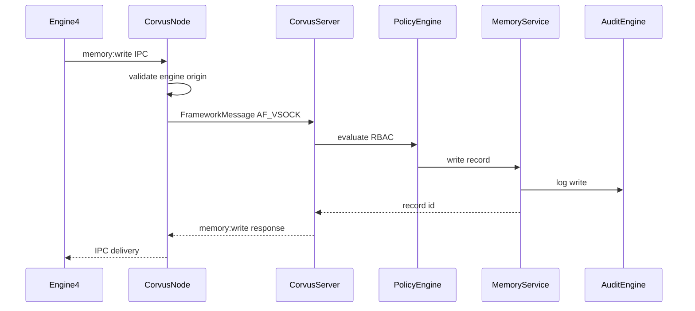
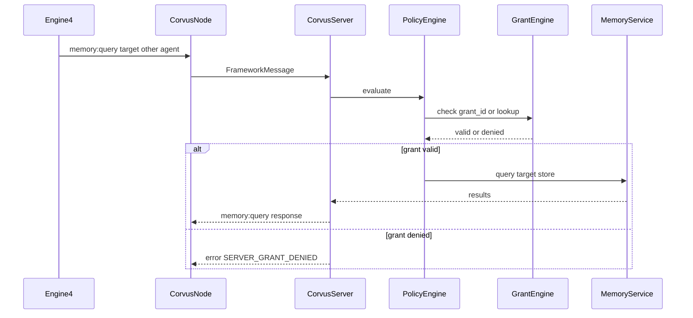
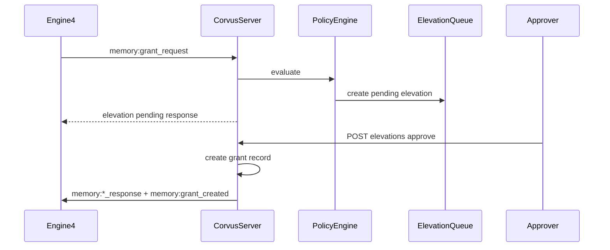

**Document:** memory/ARCHITECTURE.md
**Status:** MVP + Engine 4 Client + Semantic Search Implemented
**Organization:** Black Rain Labs
**Division:** Research & Development Division
**Last Updated:** 2026-08-20
**Related Documents:** OVERVIEW.md, hypervisor/ARCHITECTURE.md, hypervisor/FRAMEWORK-MESSAGE-PROTOCOL.md, hypervisor/RBAC-POLICY.md, agent-vm/CORVUS-NODE.md, CHANGES.md
**Must Update on Change:** CHANGES.md
**AI Instruction:** When revising this document, review Core Principles & Invariants in OVERVIEW.md, update CHANGES.md, and ensure consistency with related documents. Do not contradict core fundamentals.

# Memory Architecture

## 1. Overview

Memory is **centrally mediated**. Agents do not have direct access to persistent storage for long-term memory. All memory operations are routed through Engine 4 → Corvus Node → Corvus Server → Memory Service.

The Corvus Server owns all per-agent memory stores. Cross-agent access requires explicit grants evaluated by the Grant Engine (part of the Policy Decision Point).

**Phase 4 MVP (implemented):** SQLite-backed record storage, `memory:write`, `memory:query` (`key` and `list`), `memory:delete`, namespace quota enforcement, memory audit events, and router dispatch after RBAC allow.

**Phase 4.1 client path (implemented):** Engine 4 emits memory messages during COLLECT via Corvus Node IPC. Helpers live in `src/corvus/runtime/memory_client.py`. Each turn writes and key-queries the agent's `private` namespace; coordinator fields expose results for tests. Cross-agent access, elevation (`memory:grant_request`), and server-side auto-replay on approval are validated in integration tests (see `test_engine4_memory_integration.py`).

**Deferred follow-ups:** none for Phase 4 memory core; Firecracker guest memory turns validated by `tools/vm-smoke.sh`.

**Phase 4.3 semantic search (implemented):** sqlite-vec cosine KNN on deterministic hash embeddings at write time; `query_type: semantic` with `query.text`.

**Phase 4.5 elevation auto-retry (implemented):** on approval, server replays the stored memory operation with the new grant and delivers `memory:*_response` plus `memory:grant_created` to connected Engine 4.

## 2. Core Principles

- **Private by default** — Each agent has isolated memory namespaces; no implicit sharing.
- **Explicit grants** — Cross-agent read/write/delete requires a valid, non-expired grant.
- **Engine 4 only** — Only Engine 4 may originate `memory:*` FrameworkMessages (enforced at Corvus Node and Server).
- **Full audit trail** — Every read, write, delete, and grant evaluation is logged with correlation IDs.
- **Deterministic evaluation** — Grant checks use structured metadata only; no LLM inspection.

## 3. Data Model

### 3.1 Agent Memory Store

Each agent has a logical store keyed by `agent_id`. Stores are partitioned into **namespaces**.

| Namespace | Default Access | Purpose |
|-----------|----------------|---------|
| `private` | Owner agent only | Agent-specific long-term context, notes, session history |
| `shared-knowledge` | Owner + explicit grants | Curated facts intended for selective sharing |
| Custom (manifest-defined) | Owner + explicit grants | Domain-specific partitions declared at launch |

### 3.2 Memory Record Schema

```yaml
record:
  id: uuid                         # server-assigned on write
  agent_id: string                 # owning agent
  namespace: string                # (R)
  key: string | null               # optional stable key for key-based lookup
  content: string                  # (R) primary text payload
  embedding_ref: string | null     # reference to vector index entry
  metadata:
    source_turn_id: uuid | null
    tags: [string]
    content_type: string           # default text/plain
  created_at: iso8601              # (R)
  updated_at: iso8601
  expires_at: iso8601 | null       # TTL; null = no expiry
  version: integer                 # optimistic concurrency, starts at 1
```

**Private-by-default enforcement:** The Memory Service rejects any cross-agent operation unless a valid grant exists for the requesting agent, target agent, namespace, and permission. Owner-agent operations on own namespaces do not require a grant.

### 3.3 Query Types

| Query Type | Description | Backend Use |
|------------|-------------|-------------|
| `key` | Exact key lookup within namespace | SQLite index on `(agent_id, namespace, key)` |
| `semantic` | Vector similarity search on `content` | Embedding index (see Section 7) |
| `list` | Paginated listing by namespace | SQLite ordered by `updated_at` |

## 4. Grant Schema

Grants control cross-agent memory access. Evaluated by the Grant Engine during Policy Engine evaluation when `has_valid_grant` condition is checked.

```yaml
grant:
  grant_id: uuid                   # (R) server-assigned
  subject_agent: string            # (R) agent requesting access (caller)
  target_agent: string             # (R) agent whose memory is accessed
  namespace: string                # (R) target namespace
  permissions:                     # (R) subset of [read, write, delete]
    - read
  created_at: iso8601              # (R)
  expires_at: iso8601              # (R)
  created_by: string               # user_id or system; audit trail
  source: "launch_manifest" | "elevation" | "management_api"
  elevation_ref: uuid | null       # link to elevation record if applicable
  revoked: boolean                 # default false
  revoked_at: iso8601 | null
```

### 4.1 Launch-time Grants

Declared in the agent launch manifest. Applied automatically when the agent registers at handshake.

```yaml
launch_grants:
  - target_agent: analysis-agent-07
    namespace: shared-knowledge
    permissions: [read]
    expires_at: null               # null = lifetime of VM session
```

Launch grant records use `target_agent` as the grant storage field. Runtime memory FrameworkMessage payloads use `target_agent_id`; `target_agent` is accepted only as a transitional boundary alias until all producers emit the canonical payload field.

### 4.2 Runtime Grants

Created via:
- **Elevation workflow** — Agent emits `memory:grant_request`; server creates pending elevation; approver grants via Management API.
- **Management API** — Admin creates grant directly (`POST /v1/grants`).

Runtime grants must have a finite `expires_at` unless created by admin with explicit `permanent: true` flag (admin role only).

### 4.3 Grant Evaluation Rules

The Grant Engine returns `valid` when ALL of the following hold:

1. `grant.revoked` is false
2. Current time < `expires_at` (or `expires_at` is null for launch-time session grants)
3. `grant.subject_agent` matches requesting agent (or wildcard `*` for service accounts — admin-configured only)
4. `grant.target_agent` matches `payload.target_agent_id`
5. `grant.namespace` matches `payload.namespace`
6. Requested operation permission is in `grant.permissions`

On failure, Policy Engine returns `SERVER_GRANT_DENIED` or `SERVER_ELEVATION_REQUIRED` for grant requests.

## 5. Operation Flows

### 5.1 Own-namespace Write



### 5.2 Cross-agent Read with Grant



### 5.3 Grant Creation via Elevation



On approval, the server replays the stored memory operation (or `pending_replay` from a grant request) with the new grant and pushes the result to the connected agent. Engine 4 updates coordinator fields from `memory:grant_created` and replay responses.

## 6. FrameworkMessage Integration

Memory operations use payloads defined in FRAMEWORK-MESSAGE-PROTOCOL.md Section 10.10–10.12.

| Message Type | Grant Engine Fields Evaluated |
|--------------|-------------------------------|
| `memory:query` | `target_agent_id`, `namespace`, `grant_id`, operation `read` |
| `memory:write` | `target_agent_id`, `namespace`, `grant_id`, operation `write` |
| `memory:grant_request` | Triggers elevation; no grant evaluation on request itself |

**Response payload** (`memory:query` / `memory:write` response):

```yaml
payload:
  success: boolean
  records: []                      # for query
  record_id: uuid | null           # for write
  error: string | null
  grant_evaluated: uuid | null       # grant used for cross-agent ops
```

## 7. Storage Backend Decision

**Current storage (Phase 4+):**

| Component | Technology | Rationale |
|-----------|------------|-----------|
| Metadata & records | SQLite (WAL mode) | Simple, embedded; strong transactional guarantees |
| Vector / semantic search | sqlite-vec extension (Phase 4.3) | Keeps single-process deployment; avoids a separate vector service |
| Grant store | SQLite (same DB, separate table) | Transactional consistency with memory records |

**Scale migration path:** LanceDB or dedicated vector service if semantic query volume exceeds sqlite-vec performance targets (>10k records per agent or >100 QPS semantic queries).

**Encryption at rest (Phase 5.4, optional):** Threat model assumes host compromise is out of scope for the prototype default; data at rest is filesystem-protected unless enabled. Optional AES-GCM via `CORVUS_MEMORY_ENCRYPTION` with per-agent keys held by Corvus Server (not in VM). Schema fields `record.metadata.encrypted` and `encryption_key_id` are used when encryption is on.

## 8. Retention and Hygiene

### 8.1 TTL Policies

- Records with `expires_at` are purged by a background sweeper (default interval: 15 minutes).
- Namespace-level default TTL may be set in agent manifest (e.g., `private: 30d`).
- Deletes are soft-marked then hard-deleted after 24h (recoverable window for admin audit).

### 8.2 Namespace Quotas

| Quota | Default | Enforcement |
|-------|---------|-------------|
| Max records per namespace | 10,000 | Reject write with `SERVER_QUOTA_EXCEEDED` |
| Max content size per record | 256 KB | Reject at Memory Service |
| Max namespaces per agent | 20 | Reject at manifest validation |

Namespace quota configuration is available through `GET /v1/agents/{id}/namespaces` and `PATCH /v1/agents/{id}/namespaces/{namespace}`. These endpoints store per-agent namespace quota config and audit mutations. **Enforcement on writes is implemented in the Memory Service MVP.**

### 8.3 Audit Requirements

Every operation logs:

```yaml
audit_entry:
  timestamp: iso8601
  operation: read | write | delete | grant_check | grant_create | grant_revoke
  agent_id: string
  target_agent_id: string
  namespace: string
  record_id: uuid | null
  grant_id: uuid | null
  correlation_id: uuid
  user_id: string | null
  result: allow | deny
  reason: string | null
```

Audit entries are append-only (see hypervisor/ARCHITECTURE.md Audit Engine).

## 9. Memory Service API (Internal)

Internal service interface used by Corvus Server (not exposed to agents):

```python
class MemoryService:
    def query(self, agent_id: str, namespace: str, query: MemoryQuery) -> list[MemoryRecord]: ...
    def write(self, agent_id: str, namespace: str, record: MemoryWrite) -> MemoryRecord: ...
    def delete(self, agent_id: str, namespace: str, record_id: UUID) -> bool: ...

class GrantEngine:
    def evaluate(self, subject_agent: str, target_agent: str, namespace: str, permission: str, grant_id: UUID | None) -> GrantResult: ...
    def create_grant(self, grant: GrantCreate) -> Grant: ...
    def revoke_grant(self, grant_id: UUID) -> bool: ...
```

## 10. Design Decisions Summary

| Open Question (prior) | Decision | Rationale |
|-----------------------|----------|-----------|
| Storage backend | SQLite + sqlite-vec (semantic search Phase 4.3) | Minimal ops burden; single-process deployment |
| Encryption at rest | Optional AES-GCM via `CORVUS_MEMORY_ENCRYPTION` (Phase 5.4) | Off by default; keys held by Corvus Server |
| Graph vs vector | Hybrid: key + semantic (vector); graph relations deferred | Key/list + semantic cover current workloads |
| Hygiene | TTL + quotas + soft delete | Balances retention needs with storage bounds |

**Black Rain Labs - Research & Development Division**
